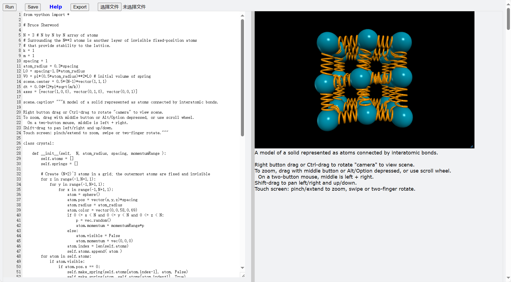
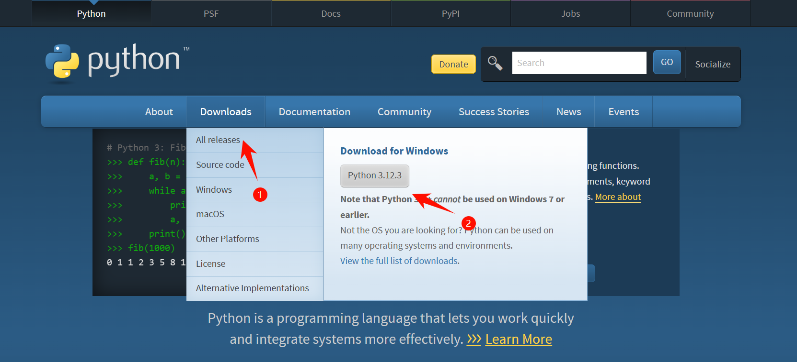
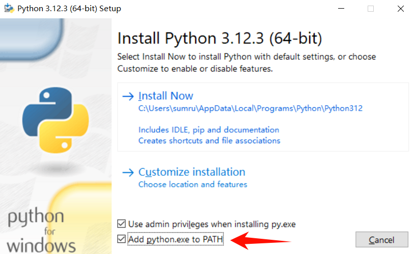
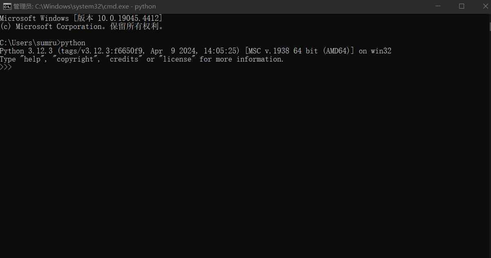

# 快速开始
使用VPython主要有3种方式：
1. WebVpython 在网页上编写和运行Vpython；
2. 本地Python环境，使用Python IDE编写和运行Vpython；
3. Jupiter Notebook，在Jupyter Notebook中编写和运行Vpython。

如果你是一个新手，并没有本地Python环境，只是想快速编写运行程序，那么推荐使用WebVpython。如果你有本地Python环境，并且想在Vpython中使用一些其他第三方库，那么推荐使用本地安装Vpython库。如果你是Jupyter Notebook用户，对Jupyter Notebook比较熟悉，那么推荐使用Jupyter Notebook。

## WebVpython
WebVpython是一个在线的Vpython编辑器，用户可以在线编写和运行Vpython代码。
你可以访问https://www.glowscript.org/ 使用VPython官方提供的编辑器。

由于VPython的服务器在国外，国内可能会访问速度慢或无法访问。你也可以访问https://ide.vpython.cn (暂未上线)使用本站提供的编辑器。

此外，Vpython官方还提供了WebVpython的离线包， 你可以将它下载下来解压，在本地运行WebVpython。



## 本地Python环境

你需要做以下准备：

1. 在电脑安装Python环境；
2. 安装VPython库；
3. 安装一个好用的代码编辑软件，推荐Visual Studio Code。

### 1. 在电脑安装Python环境
访问Python官网https://www.python.org ，在Downloads中选择适合你的系统的最新版本下载。




下载后双击运行，勾选"Add python.exe to PATH"，点击"Install now"，稍等一会便安装好了。


运行"cmd"，输入"python"，如果出现"Python 3.x.x"字样，则安装成功。


### 2. 安装VPython库
在上一步输入`exit()`回车，退出python，或者重新打开cmd。

输入下面代码回车运行，安装VPython库（该命令已经使用清华源，在国外仍有较好的下载速度）
```sh
pip install vpython -i https://pypi.tuna.tsinghua.edu.cn/simple
```
等待安装完成。

### 3. 安装Visual Studio Code
访问Visual Studio Code官网https://code.visualstudio.com/ ，下载适合你的系统的安装包。

下载后运行安装并打开，这时候可能会提示你安装Python所需要的插件，请按提示安装。

接着你就可以在Vscode中编写VPython代码，然后点击右上角的运行按钮来运行程序了。